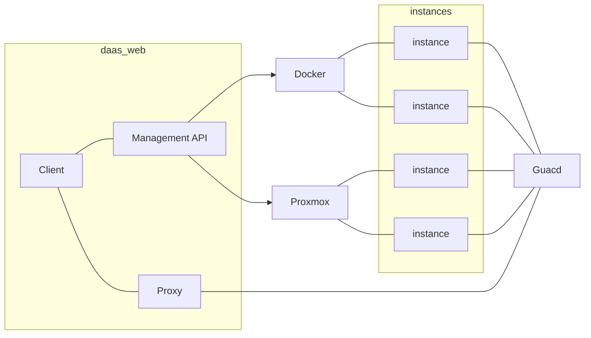
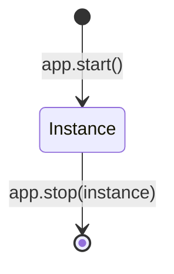

# Architecture overview

The `qweb` application is a Python web application providing the following aspects:

- it provides a **minimal user interface** for demonstrating DaaS functionality
- it provides a **REST API** for browser-side code, e.g. for stopping a container
- it provides a **proxy** so that clients
  can directly view remote desktop contents in the browser,
  without having to manage their own VNC connections
- it manages the **application lifecycle** and stores necessary data in a **database**
- it contains **business logic** for managing **containers** and **VMs**

This document explains some of the more high-level architecture aspects in details.

## Vision

This document describes the *status quo* of the system, but that is shaped
by concerns about the future evolution.

In the end, this software should be able to manage containers and VMs
and provide a Guacamole proxy for those instances:

This should eventually also support the lifecycle of *creating* new applications,
but right now the focus is just on start/stop of application instances.

## Web Application

The web application uses the [Quart](https://quart.palletsprojects.com/) web framework.
This is a lot like the popular `Flask` framework,
but supports async operations
– which we need for feeding the browser client via a WebSocket connection.
Configuration is currently retrieved from environment variables or any plugin component,
see the related module for details.

The routes are defined in the loaded plugin components as well.
This contains all of the UI code and the REST API –
maybe this will be spread across multiple modules in the future.
Jinja templates are defined in `src/app/webroot/templates`.
Assets (such as necessary JS code) are in `src/app/webroot/static`.

Most of the routes just figure out which data to retrieve
from the DB and which class to invoke.
Where access to external components is needed (Guacd, Docker, Database),
these connections are mediated through the qweb environment.

All of the routes *must* be non-blocking.
The application runs on a single thread.
If one request blocks progress,
other requests cannot continue.
In particular, the VNC feed via WebSockets will be delayed.

## Database

The database is made available through the `sqlalchemy` ORM component.
This class represents a kind of repository or data access layer,
isolating the rest of the code from DB-specific details.
Currently, the system uses a MariaDB or SQLite database.

## Proxy

See: [Proxy Architecture](proxy.md)

## Business logic

Business logic involves juggling containers and VMs, applications and instances.

### Concepts

Currently, the system uses three central concepts,
as defined in the central \[`src.app.daas.common.model`\]\[\]:
applications, instances, and connections.

An **application** (\[`DaasObject`\][src.app.daas.model.DaasObject])
is configuration for something that can be started.
It controls the lifecycle of its instances.
There are subclasses for concrete scenarios,
e.g. `ContainerApp` or `MachineApp`

A DaaS-Object is anything that can be started and then viewed by the user,
but it might play the role of an environment/deployment/application
depending on its state.

An **instance** (\[`Instance`\][src.app.daas.model.Instance])
is a running application with an associated connection.
Technically, an `Instance` is created just
before the corresponding resources are launched.
This is necessary so that resources like port numbers
can be allocated for that instance.
Once actually started, the instance is updated
with information like a Docker container ID.

A **connection** (\[`Connection`\][src.app.daas.model.GuacamoleConnection])
describes how the user can be shown the remote desktop contents.
There are classes for specific types
(e.g. \[`GuacamoleConnection`\][src.app.daas.common.model.GuacamoleConnection]),
and they contain information such as connection passwords.
Connection details are used by the proxy, but never exposed to the user.

### Lifecycle

For containers, the application lifecycle is fairly simple:
Apps can start instances, and then later stop them:

These state transition methods are responsible for effecting the actual change,
and for tracking any necessary state in the database.

## Limitations

See: [Limitations](limitations.md)
