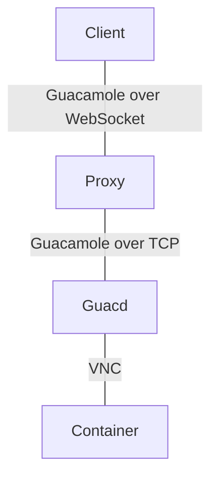

# Proxy Architecture

The proxy components are needed to support the remote desktop connections
of various connection types.
However, there are significant differences depending on backend.

Historically, the Kasm proxy came first.
It was implemented in order to test proxy support (including WebSockets)
without also having to solve the Guacamole protocol problems at the same time.
In the final deployed system, Kasm is not expected to be used.
Instead, the focus is on the Guacamole proxy.

## Guacamole Proxy

For Guacamole connections, any `/instance/*` request
renders the guacamole-viewer template,
which then establishes a WebSockets connection on same URL
for transferring input events and screen contents.
The details of the Guacamole WebSocket proxy
are contained in the \[`src.app.daas.proxy.guacamole_proxy`\][] module,
with the
\[`proxy_guacamole_ws()`\][src.app.daas.proxy.guacamole_proxy.proxy_guacamole_ws]
function being the main entrypoint.

To illustrate this in context:



The proxy translates the streams of Guacamole protocol events in *both* directions,
just changing the transport protocol.

This corresponds to the normal Guacamole system architecture,
except that we have swapped out the Guacamole web front end for the `qweb` proxy.
It is necessary to replace the Guacamole frontend
so that connections can be created to the managed Docker containers
without the users having to interact with details like connections.
Users just start an application and then directly get a VNC screen.

In the Client → Guacd direction, the proxy has capabilities for additional filtering,
which is needed for handling ping messages and screen resize events.

More involvement is needed during the protocol's handshake phase,
where authentication and connection details have to be provided to Guacd.
Details can be found in \[`src.app.daas.proxy.handshake`\][].

Utilities for the proxy are implemented in other modules:

- \[`src.app.daas.proxy.syntax`\][] – parser for the Guacamole protocol syntax.
- \[`src.app.daas.proxy.streams`\][] – abstraction over Guacamole streams,
  including both TCP and WebSocket support.

## Chrome support

The demo has always worked under Firefox, but Chrome was refusing the WebSocket request.
This is solved now.

Hypothesis 1: Security problems due to testing with `ws://` instead of `wss://` urls.
This could be disproven experimentally.

Hypothesis 2: WebSocket subprotocols are causing problems.
This failure mode could be demonstrated experimentally.

When the JS client creates a WebSocket, there is an optional subprotocol parameter:

```js
new WebSocket("ws://...", "guacamole")
```

When a subprotocol is used, this causes
a `Sec-WebSocket-Protocol: guacamole` header to be sent.
Both Firefox and Chrome do this.

However, the server is supposed to confirm the subprotocol by sending it back.
Our server didn't do this.
Firefox ignored the response header,
but Chrome does not (and fails with a completely nondescriptive message).

The solution is to explicitly invoke `websocket.accept(subprotocol="...")` in Quart.

Sources:

- [WebSocket constructor on MDN](https://developer.mozilla.org/en-US/docs/Web/API/WebSocket/WebSocket)
- [`Sec-WebSocket-Protocol` on MDN](https://developer.mozilla.org/en-US/docs/Web/HTTP/Protocol_upgrade_mechanism#sec-websocket-protocol)
- [`Sec-WebSocket-Protocol` in RFC 6455](https://www.rfc-editor.org/rfc/rfc6455.html#section-11.3.4)
- [`WebSocket.accept()` method in Quart](https://quart.palletsprojects.com/en/latest/reference/source/quart.wrappers.websocket.html#quart.wrappers.websocket.Websocket.accept)
