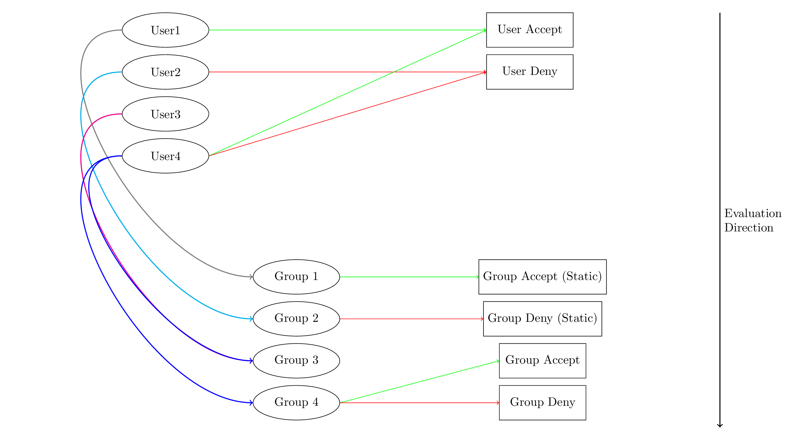
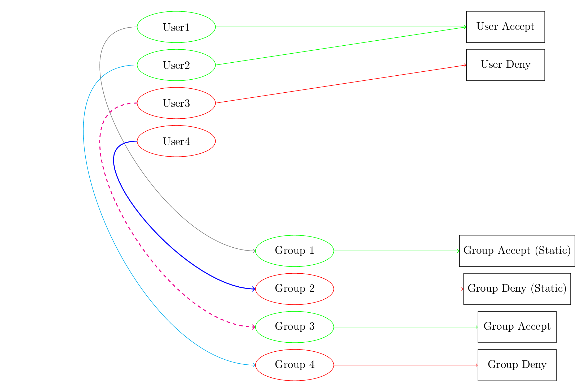
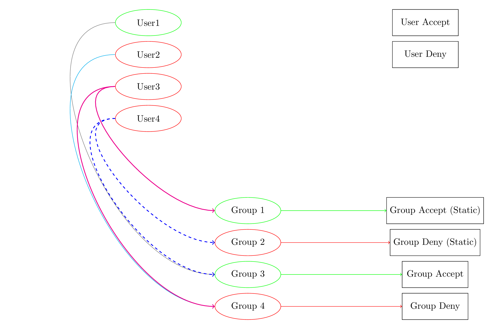

# Authentication
In order to authenticate requests from our frontend to the backend, a
decentralized approach was chosen. We added a dedicated authentication
component to our system architecture, which implements OAuth2 as it is
one of the most popular industry-standard protocols for authorization.
The component was implemented using the PHP programming language and is
hosted as a dedicated and external service. The service offers a public
and well-documented REST API and stores the necessary information to
offer its authentication services in a local database.

## Data Structure
The contained database generally divides users into the two major
groups: "Users" and "Administrators". Each user entity provides at
least the attributes id (unique), enabled, groups, email, name, and
scopes. Additionally, each user or admin might be part of an arbitrary
number of groups currently containing the two properties id (unique) and a
description.

## Access Methods
The system provides a well-documented public REST API to interact with
the service. For all major entities, the appropriate GET, POST, and
PATCH methods are provided. Furthermore, the system provides several
auxiliary methods for testing and debugging, such as, for example, the
"oauth2/user/session" method, which can be used to check the privileges
of the currently logged-in user. To log in to the system, a user is
required to send their credentials to the authentication system and
receives back an OAuth token. With that token, a user can verify that
they are currently logged in. The token has a default expiration
timer, which can also be extended during its lifetime.

## Current Verification Approach
Currently, only the authentication mechanism itself is integrated into
our DaaS backend system. The backend system currently follows the
approach of receiving an OAuth token from the frontend user, which has
to be checked and verified against the authentication system. This can
be done either by acting on behalf of the frontend user and supplying
the frontend user's token to the "oauth2/user/session" method.
Alternatively, a dedicated endpoint could be implemented, allowing a
backend user to utilize their own legitimate session token and
providing the frontend user's token only as a parameter. In this way,
users would not be "impersonated" by the backend user. Therefore, the
latter solution is generally preferable.

## Privilege System
As described before, currently only the approach to verify logged-in
users is implemented. Additionally, it is planned to provide a more
granular method to grant or deny access to the system on a functional
level. With that in mind, the overall aim of such a solution should be
on one hand to minimize the additional integration efforts needed to
adjust the database layout or endpoint specifications. On the other
hand, the solution should aim to maximize a wide range of possible
configuration use cases in order to provide convenient and appropriate
management efforts when handling large amounts of groups and users. In
any case, the decision for a specific approach will ultimately also
influence the performance of the whole system when taking into account
the number of requests needed to verify a particular user action. In
the following, a draft version is described, which aims to optimize
all three stated problem dimensions.

### Prerequisites
In order to provide a privilege-based verification on a functional
level, the initial step would be to assign a list of unique identifiers
to each method callable by system users. This list
of currently 71 unique identifiers is the ground truth information
on which backend and authentication component agree upon initially.
The endpoint privileges must then be distributed
over plausible user and group entities
in the form of static integer lists for both
acceptance and denial of a particular right.
Further, an appropriate endpoint
to intially request all static groups at once is required.
In a debugging context it might make sense
to additionally provide an endpoint to set all groups and users at once.

### Privilege Hierarchy
Based on this information, individual accept privileges can then initially be
stored within each user entity in the authentication system to allow
specific actions. With the aim to also allow the denial of a specific
privilege, the user entity might additionally store a list of denied
privileges. In order to provide a more convenient way to handle large
user amounts, such accept and deny lists can also be added to all
group entities within the authentication system. As a further
optimization, certain groups can also be marked as "static" by using a
dedicated property within a group entity.
This property is aimed to mark groups that do not change too frequently
and allows the backend
to cache contents of such groups.
In total, three major rules are required to reflect such constraints:

- By storing accept and deny lists within each user entity, arbitrary
  privilege use cases can be handled on a user-specific level.
- By storing accept and deny lists within each group entity, arbitrary
  privilege use cases can be handled on a group-specific level.
- By caching such groups, the total number of requests needed to
  verify a particular action can be further reduced.

### Privilege Precedence
As privileges might be part of user or group specifications and since
privileges are also deniable, a certain precedence or evaluation order
has to be defined. The precedence is therefore defined as:

- Level 1.1: User Accept Rules
- Level 1.2: User Deny Rules
- Level 2.1: Group Accept Rules (Static)
- Level 2.2: Group Deny Rules (Static)
- Level 3.1: Group Accept Rules
- Level 3.2: Group Deny Rules

### Verification Requests
Combining all mentioned requirements, an approach to verify specific
user actions can therefore start by evaluating all user-specific access
and deny lists. If the request cannot be verified by accounting that
information, the authenticator can advance to the next level and
account all static group-specific access and deny lists. If the request
cannot be verified by accounting that information, the authenticator
can advance to the next level and account all non-static group-specific
access and deny lists.

- If the request can be verified in the first step, then only one
  request is needed in total to fetch all information.
- If the request can be verified in the second step, then no additional
  request is needed to fetch all information as they are cached by the
  backend system.
- If the request can only be verified in the third step, then one
  request per assigned non-static user group is needed in total to
  fetch all information.
- The algorithm ommits non-static group requests if a static deny rule
is found immidiately (higher precedence of deny rules).
- If the request cannot be verified in the third step, the overall
  result of the verification process is negative.

## Essential Verification Requests
Depending on the actual structure of the user and group privileges, it
might be possible, in an optimal case, to verify actions by only
issuing one request to the backend (User request only).
In a worst-case scenario, each
non-static group specification has to be requested individually.
The total number of requests needed is then 1 + n,
where n is the number of non-static group
memberships. It is therefore highly advisable to keep most group
specifications in static groups.
The number of non-static groups should be kept as small as possible.
Static groups should usually be used to define regular users.
User privileges are meant to be used
to temporarily overwrite the default group privileges.
Static groups with active deny rules can be used
to reflect longer lasting privilege revocations.

\newpage
### Privilege Hierarchy

Users and groups:

- Users might have access or deny privileges at once (Deny over Accept)
- Groups might have access or deny privileges at once (Deny over Accept)
- Users can be have 0 to many group memberships
- Privileges are evaluated from top (users)
to bottom (static first, then non-static groups)

\newpage
### Best Case Scenarios

All actions need only one request to verify:

- User1 is accepted by user privilege
- User2 is accepted by user privilege (User over group)
- User3 is denied by user privilege (User over group)
- User4 is denied by static group privilege

\newpage
### Worst Case Scenarios

Three worst case scenarios and one optimal case:

- User1 is accepted by non-static group privilege
- User2 is denied by non-static group privilege
- User3 is denied by non-static group privilege (Deny over Accept)
- User4 is denied by static group privilege (No worst case!)

