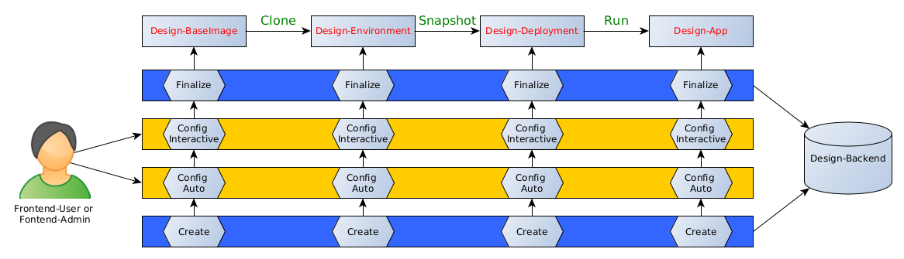

# Description

Backend Api and integration layer to control several services
being used in the process to provide a desktop as a service (DaaS) solution.

## Definitions

Initial definitions:

- Externally defined: GUI, Linux/Windows system, Object, Application, Client, Service, etc.
- Object: Any application
- Usable Objects: Any application that have a GUI and can be natively installed on a current Linux or Windows system.

General Design-specific definitions:

- Frontend: Website acting as user interface
- Frontend-Service: Required service to provide frontend functionality
- Frontend API: Communication interface between frontend and backend (Hosted as web service within the backend)
- Frontend-Database: Database to store session-related information and user configuration
- Backend: Core components implementing usecase functionality and Backend-Service interaction
- Backend-Service: Required service to provide Backend functionality
- Backend-Api: Communication interface between Integration-Layer and Backend-Services
- Backend-Database: Database to store state information for Apps, Deployments, Environments, Baseimages
- Frontend-Users: Endusers utilizing the frontend to interact with Usable Objects (THE user!).
- Frontend-Admin: Experienced Frontend-Users providing Design-Baseimages and Design-Environments for other Frontend-Users

Integration-Layer specific definitions:

- Design-App: Usable objects within Design-Deployments and provided through a web browser.
- Design-Deployment: Containerized or virtualized Design-Environment which contain Design-Apps.
- Design-Environment: Configured Design-Baseimage which contain Design-Deployments
- Design-Baseimage: Installed and configured platform hosted on a Backend-Service
- Design-Instance: A virtualized or containerized system with minimal communication infrastructure (ssh+pubkey-auth+known ip)
- Design-Node: A machine on which the Design-Appliance is installed and configured

Backend-Api:

- Instance: Running App, Deployment, Environment or Baseimage
- Connection: VNC or RDP connection created within Backend-Service guacamole
- VM: Virtual machine created within Backend-Service proxmox
- Container: TODO

## Backend-API

The specified API is part of the backend. It is meant to be used by other components of the backend in order to encapsulate the required functionality into a dedicated component. This dedicated component currently acts as a wrapper for the three backend services, proxmox, guacamole, and dnsmasq but might perspectively integrate other services as well.

The API shall mainly be used by a higher order integration layer of the backend which maintains state and a separate communication channel between the backend and frontend. The API is designed to only indirectly interact with users of the DaaS appliance. It can therefore be seen as a broker between all relevant backend services and the integration layer or the frontend.

The API is composed of four major components that are put together within the superior ApiDesign component, representing the actual Backend-API as defined. This Backend-API can be configured by using dedicated configuration objects and is either invoked directly through the integration layer or for debugging purposes through the ApiCmd.py component.

There are currently four core components which are accompanied by one or more auxiliary modules and dedicated configuration objects.

For proxmox, these are:

- ProxmoxApi: Interacts with the proxmox service via REST (-> VM Management)
- ProxmoxRestConfig: Contains required configuration
- ProxmoxRestRequest: Utilizes HttpAdapter to perform Rest requests against the proxmox API

For nodes, these are:

- NodeApi: Interacts with the local operating system (-> Local services, e.g., dnsmasq)
- ProxmoxNetworkConfig: Contains required configuration.
- ProxmoxNetworkRequest: Utilizes SshAdapter to perform requests against the responsible DHCP server.
- TODO: ProxmoxNetworkConfig and ProxmoxNetworkRequest are WIP here! They are still part of ProxmoxApi, therefore the name. It shall be part of a NodeApi, which has to be implemented first.

For instances, these are:

- InstanceApi: Interacts with VMs or containers by using a custom Python component (-> Guest OS and Application Management).
- InstanceControllerConfig: Contains required configuration.
- InstanceController: Utilizes SshAdapter to perform requests against the CommandProxy within a running instance.
- CommandProxy: Located within running BaseImages, Environments, or Deployments to establish a basic communication channel.

For guacamole, these are:

- GuacamoleApi: Interacts with the guacamole service via REST (-> Connection Management)
- GuacamoleRestConfig: Contains required configuration
- GuacamoleRestRequest: Utilizes HttpAdapter to perform Rest requests against the guacamole API.

Two additional helper classes are acting as adapters being used by other components of the Backend-API. These are:

- HttpAdapter: Request and response handling between Backend-Services and components of the Backend-API. Throws exceptions.
- SshAdapter: Utilized to control running Design-Instances. Throws exceptions.
  

## Error handling

In general, appropriate return codes are given, and exceptions are thrown wherever required, but the plausibility of each invocation is not controlled at all.
It is assumed that a high layer is able to invoke semantically correct sequences by using its own state information.
Other than that, the API prevents syntactical user errors such as wrongly specified parameters.

As the component generally acts as a wrapper and, therefore, only forwards responses obtained by invocation of certain Backend-Services.
The API currently avoids introducing its own notion of error codes or error handling.
That implies that an invocation to the API resulting in an HTTP request would also yield an HTTP response.
An invocation to the API resulting in the creation of a new subprocess would yield the response code of that subprocess.

Three examples:

- The API can be invoked to stop a VM with a certain vmid and will request that action from the backend service even though a particular VM might not exist. Therefore, the requested action against the proxmox services would end up with a 500 HTTP response code which the API would return.
  The ApiCmd component would treat everything other than a 200 response as an error and produce a response code on the command line which is unequal to zero.

- In another example, the API might be used to configure the IP for a particular VM which leads internally to the manipulation of a config file for dnsmasq and the restart of that service. If, for any reason, the service cannot be restarted, an appropriate error code from that subprocess is returned.
  In that case, the error code of the subprocess is returned by the API.
  The ApiCmd component would treat everything else than the return code zero as an error and yield on the command line a response code unequal to zero.

- In a third example, the API might be used to create a VNC connection within Guacamole, but the configuration specifies a wrong hostname within the URL for the Guacamole backend.
  In that case, the API would try to reach the malformed URL several times until a certain amount of reconnects is reached. If no connection could be made, an exception would be thrown, indicating the root of the problem.
  In that particular example, a requests.exceptions.ConnectionError exception was thrown with the reason 'No route to host.'

## States

The API is designed to be stateless, which means that a caller has to take care that input parameters are valid.
The caller has to keep a record of at least the identifiers assigned to usable objects being created within contained Backend-Services such as guacamole or proxmox.
In that sense, the API provides methods to obtain that data and store them separately
but does not automatically invoke them to assign such identifiers.
In most cases, this boils down to only identifiers but can also occur in rarer use cases and for other parameters.

Another problem is the occurrence of race conditions.
As the API does not maintain a state on its own, the API itself must, at some points, contact service and act in addition to the received response.
Suppose the state of the Backend-Service changes after the response was sent to that caller. In that case, the API might act on behalf of outdated information resulting in an invalid state of the respective backend service.
Therefore, a higher-order integration layer has to ensure that no other correlating state changes happen between requests depending on each other.

Two examples:

- If the API is invoked to change the configuration of a particular VM, then a request to do so is, in any case, forwarded to the responsible Backend-Service proxmox. This is also the case if that particular configuration is already present, and the request could be omitted theoretically.

- If the API is invoked to delete a VNC connection within guacamole, a first request might be issued beforehand, which lists all connections currently stored within guacamole. This list maps the vmid input parameter to the corresponding connection id, which is then used to delete the connection.
  The second request to delete the request would unintuitively fail if the connection was already deleted by another request in between.

## Integration Layer

To integrate the API, an integration layer is needed to overcome the current prototype's limitations.
On the one hand, error codes, error messages, and logs have to be managed in a well-defined manner, and exceptions have to be thrown more appropriately.
On the other hand, the already mentioned state aspects have to be taken care of, which involves the persistence of data and the exclusion of multi-threading issues.
On top of that, the most important aspect of object management has to be defined.
As planned, the integration layer does not instantiate or destroy any usable objects on its own
but only controls the lifetime of such objects within Backend-Services.
The integration layer provides means of communication to the frontend by which state changes of such objects can be expressed
in order to reflect the desired use-cases of frontend users.
Direct interaction between Backend-Services and frontend users is appropriately prevented.

Major components:

- Frontend-Api: Web-based service to receive and process invocations from the frontend.
- ?Model-Store?: Registry for abstract models of usable objects (Currently only kasm/docker, After merging also VMs)
- Backend-Database: persists state information for usable objects in a local file (currently sqlite)
- Backend-Api: interacts with backend Backend-Services
  

## Integration Concept

The Integration Layer maintains four major entities which are able to reflect all necessary state and configuration for hosted applications to a particular point in time.
They generally act as information source in order to create, manipulate or destroy resources within Backend-Services and on behalf of actual users or admins.
Currently there are four phases which are coined 'BaseImage' (Phase0), 'Environment' (Phase1), 'Deployment' (Phase2), and 'App' (Phase3).
In the current version they envisioned to inherit properties of prior phases and can be seen as nodes in a directed graph.
The nodes are connected through directed edges between Baseimage and Environment, between Environment and Deployment as well as between Deployment and App.
In that order the edges are coined 'CloneTemplate' (Transition0), 'CreateSnapshot' (Transition1) and 'RunApp' (Transition).

Therefore any object starts at first as a Baseimage and progresses linearly through this directed graph until it is finally deleted.
(In a future version this directed graph might also be turned into an undirected graph allowing for more flexibility and more sophisticated usecases.
Some of these usecases might imply a crucial problem such that sensitive of one user might be stored within a vm which gets copied to another user which might then potentially obtain the sensitive information of the other user.
This has to be prevented to any point in time and therefore future usecases have to be integrated while keeping that in mind.
Therefore lets pretend its a directed graph for now!)

In addition to that, all but the last phase can be further partitioned
into four subphases with the expressive names 'Create' (SubPhase0), 'ConfigAuto' (SubPhase1), 'ConfigInteractive' (SubPhase2) and 'Finalize' (SubPhase3).
The configuration subphases ConfigAuto and ConfigInteractive allow users to contribute to the instantiation process at that particular point in time.
The Create and Finalize subphases are allowing the backend to take care of all relevant steps to progress further through the graph.
These phases and subphases are in general designed to be flexible enough to adopt to potentially contradicting concepts in order to reach the same ultimate goal of hosting an app through a web browser.
These are:

- Containers vs. VM's -> Distinguished by type parameters in all major entities
- Windows vs. Linux vs. Linux+Wine -> Apps can be installed into all suited platforms
- VNC vs. RDP -> VNC for all instances, Optionally RDP for all (installed and configured!) Windows-instances
- Organizational Logic vs. User logic -> Admins ensure business constraints, Users ensure user constraints
- Installation vs. Configuration vs. Utilization -> Entities allow automated and interactive approaches

## VM-Approach

The integration concept is mimicking workflows of the VM-driven approach within proxmox
where virtual machines can be represented as regular plain virtual machines, virtual machine snapshots or virtual machine templates.
On one hand this approach allows to provide very fast clone times from virtual machine templates into regular virtual machines but does not allow to create template snapshots.
On the other hand regular virtual machines can contain trees of snapshots to reflect specific states of running and stopped virtual machines but are not very efficient in data storage and access times as well as the time required to clone into another virtual machine.
Regular plain virtual machines without snapshots are possible and represent a virtual machine in its most lightweight manner.
As no snapshots are contained cloning is as fast as clong from a VM-Template but does not offer possibilities to represent managable states.

In general, a similar approach is also possible in order to reflect container-based environments.
Container-based environments are in general more lightweight compared to VM's but must still be prepared in a comparable manner
if they are used to host applications in an automated DaaS approach (e.g. Basic Communication, Organizational Config, User Config, App Config, etc.).

This includes the installation, configuration and customization of operating systems, specific user-environments or individual applications.
Steps in that process must either be completely or partially automated while also offering interactive approaches if necessary.
For each of these steps a majority of the work can be done automatically or on-the-fly
under the assumption that required configuration and installation options are configured before within the frontend.
It is assumed that a Frontend-User and a Frontend-Admin will each individually contribute to distinct phases of the objects life-cycle.
Essentially, a Frontend-Admin might provide Baseimages or Environments containing all required business-logic and organizational constraints.
In contrast to that a Frontend-User might contribute more to the customization and individualization of Environments, Deployments or the running app itself.

With that in mind the four mentioned entities reflect individual aspects for the same objects life-cycle
while also offering possibilities to distinguish between virtualization and containerization approaches.
Additionally this data organization allows to leverage the advantages of the underlying virtual machine backend
while also minimizing the disadvantages of it partially by turning Baseimages into fast clonable templates
and by representing deployments as fast awakening snapshots.

## Container-Approach

TODO: Describe how the lightweight container-concept can be extended to match the described phases and subphases of the VM-Approach.
Both approaches should be conceptionally aligned to behave similarly
such that a common entity concept can be provided from the Frontend-Api to the Frontend-User or Frontend-Admin.
As a result of that alignment the provided entity concept shall be be agnostic to the underlying VM or Container implementation!

### Entities/Phases

#### Design-Baseimage

A Design-Baseimage is the first stage a usable object can be in.
It offers possibilities to store metadata with respect to the installation and configuration of the object and must at least contain means of basic interaction between the instance and the Backend-Api in order to provide a rudimentary access for further configurations and installations.
In the current state this includes at least a properly configured ssh-server including a list of authorized keys for authentication.
Further a specific IP-address has to be assigned. Currently it is assumed that this ip never changes and is uniquely tied to the underlying vm identifier or container identifier.
The phase as a whole is therefore meant to be used to install the operating system, to include the basic communication infrastructure as well as for organizational configuration (e.g. Windows Active Directory, ACL's, Usernames, Hostnames, etc).
In the case of a vm it is represented as template with fast clone times and efficient usage of storage.
In the case of a container it might be represented as regular container image.
An admin user might append organizational configuration and installation and provide such prepared images to other users.

#### Design-Environment

A Design-Environment is derived from a Design-Baseimage.
As a result the environment initially inherits properties from the Baseimage but can also be updated to reflect different configurations (Network connection, Ip, Hostname, mapped storage, etc.)
The environment therefore always contains a proper communication infrastructure and potentially organizational software and configurations.
In the current stage no required steps have to be taken but users can optionally customize their environments as a preconfigured base for one or multiple deployments.
Hence, the phase is meant to be used to configure for example user credentials (Windows-Live, Git, Confluence, etc.).
By our own constraints the limit of environments per user is currently always one
but from a technical perspective more would be possible if sufficient hardware resources are available.
In the case of a vm it is represented as regular vm with at least one snapshot to offer user customizations.
In the case of a container it might be represented as staged image on top of a container-based Design-Baseimage.
An user might append custom configuration and required services as a common base for deployments.

#### Design-Deployment

A Design-Deployment is derived from a Design-Environment and inherits it's properties initially.
The deployment contains all relevant communication infrastructure, all organizational configurations as well as the user related customizations.
Besides that, the deployment enables to install and preconfigure applications being hosted.
The only thing missing for an deployment to run is the actual application being hosted.
Hence, the phase is meant to be used to install and configure the hosted app only(e.g. Mircosoft Office Suite).
In the case of a vm this might involve the utilization of live snapshots containing state of a running operating system and application
but it can also be an offline snapshot with longer loading time but more efficient utilization of data storage.
In the case of a container this might be represented as staged image on top of a container-based Design-Environment.
Any finalized deployment can be started and stopped in a lightweight manner and does not involve additional steps prior to their start.

#### Design-App

A Design-App is derived from a Design-Deployment and inherits it's properties and state initially.
Similarly to Design-Deployments the Design-App contains all relevant installations and configurations and is ready-to-use with respect to it's instantiation and can therefore be started, restarted and stopped to any point in time.
The phase is meant to be used on top of a finalized Design-Deployment and contains a preconfigured command to run the hosted app.
Cloning such a prepared Design-App might additionally be possible from a technical point of view
but is undesirable as users are currently constraint to posses only one environment.
Hint: In the case of a vm this would also take an inappropriate amount of time and in most cases cloning from a Design-Baseimage into a Design-Environment would be much faster if the configuration for that environment is non-interactive.
In the best case the difference would be a few seconds for cloning from the template in contrast to a couple of minutes for cloning from a regular vm of the same size.
For containers a similar approach is generally not as resource-consuming and often desirable by users.
The solution might therefore allow clones of container-based Design-Apps.

### Instantiation Time

By following the described principles a running app can always be instantiated from scratch in only 3 major steps.
The numbers mentioned in the following are not very scientific yet!
These numbers should just be seen as a rule of thumb for now as no other data is available currently!
The chosen setup follows the best practices given by proxmox and involves a virtio-stack for at least storage, RAM and network drivers.
Link: <https://pve.proxmox.com/wiki/Windows_10_guest_best_practices>
The approximated amounts might differ drastically if no virtio drivers are used!

Approximated time for a full usecase:
A very rough approximation for a fully automated approach would be
that a simple app might completely be installed, configured and created 'ready-to-use' in under one minute.
If the app was already prepared before (Baseimage+Environment+Deployment), than the time to instantiate might shrink down to under 10 seconds.
This is achieved by following the aforementioned principles and the described phases and subphases.

- Baseimage: By Cloning from Baseimages the most time consuming aspect of the whole process
  can be delegated into a preparation phase which does not affect instantiation time of Frontend-Users but only by Frontend-Admins and only once prior actual usage.
  Even if automated, the pure installation of Windows might take up to one or more hours, depending on the available internet connection and if a full-fledged windows updates has to be done.
  Nevertheless, on the current development hardware clon1ing of such an installed image can be done in approximately 1 to 5 seconds (64GB image size).

- Environment: By Creation of dedicated user environments the most time consuming aspect for Frontend-Users
  can be delegated into a configuration phase which is in the best case only executed once per application.
  Any Environment therefore contaions at least one root snapshot containing user specific installation and configuration.
  On the current development hardware the creation of this snapshot can be done in under a minute.

- Deployment: By instantiation of live snapshots the most time consuming aspect of booting the operating system
  can be delegated into a prior preparation phase.
  If the environment does not enforce interactive installation steps than the phase can be finished in a couple of seconds.
  For the snapshot the hosted app has to be installed and configured which can later be invoked through a Design-App.
  For a live snapshot the RAM and Storage have to be appended to the snapshot which creates a non-marginal overhead in disksize.
  On the current development hardware this can be done in a few seconds if the application does not enforce interactive installation steps.
  The test system required approximately 10 seconds for a live snapshot containing an additional 17GB disk which includes 8GB of RAM.

- App: As Apps are preconfigured Design-Deployments any app is by definition ready-to-use.
  An app can be based either on a live snapshot which contains the running hosted app and which can be instantiated in 3 to 5 seconds.
  Alternatively, the app can be based on an offline-snapshot where the hosted app is configured but not yet running as a process.
  Therefore offline-snapshots still need a preconfigured command-line
  in order to invoke the hosted app as soon as the operating system has successfully booted.
  On the current development hardware the time to boot into Windows10 requires approximately 30 seconds
  and the time to run the app is under 1 second.

## Usecases

## Views

