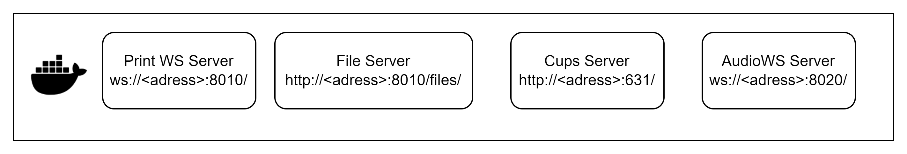

# Erweiterung um Mikrofon und Drucken für VNC

VNC unterstützt Audio und Drucken grundsätzlich nicht. Aus diesem Grund müssen diese durch zusätzliche Verbindungen geleitet werden. 


## Druck-Konzept Erklärung
Die Idee ist, für jeden Benutzer einen Cups-pdf Drucker zu erstellen. Dafür wird einen CUPS Server auf dem VNC_Extention Container installiert. Der Server läuft auf Port 631 und kann unter ``http://<Container_Adresse>:631`` erreicht werden. Die angepasste Konfigurationsdatei liegt im ``VNCService/scripts/cupsd.conf``. Um mit CUPS zu kommunizieren wird einen ExpressJS Server verwendet. Der Web-Client verbindet sich damit über eine Websocket-Verbindung. Sobald die Verbindung erfolgt ist, schickt der Client eine Nutzer-ID die als Druckername verwendet wird. Der Express Server führt dann einen Shell-Skript aus, der einen Cups-pdf Drucker für diesen Nutzer erzeugt (``VNCService/scripts/create_printer.sh``). Wenn der Drucker bereitsteht wird die Adresse des Druckers an den Client gesendet (Relevant nur für meine Frontend). Die Adresse des Druckers lautet: ``http://<Container_Adresse>:631/printers/<client_id>``. Dieser Drucker soll in der Remote VM/Container als IPP Drucker hinzugefügt werden. Die Druckaufträge von den Remote-Desktop werden über IPP an den Cups-pdf-Drucker gesendet, dieser erzeugt eine PDF daraus und schickt den Dateipfad per Postprocessing-Skript an den Express Server über eine REST-API. Der Express Server entnimmt daraus die Client-ID und schickt den Dateipfad an den Client. Dieser kann die Datei über einen Dateiserver herunterladen. Der WS-Server läuft per default auf ``ws://<Container_Adresse>:8010`` und der Dateiserver auf ``http://<Container_Adresse>:8010/files``. Für jeden Nutzer wird einen Unterorder erzeugt, wo sich seine PDF Dateien befinden.

## Mikrofon-Konzept Erkärung
Die Grundidee ist das Audio im Browser aufzunehmen und über eine WS Verbindung an einen ExpressJS Proxy Server zu übermitteln, der die Audio-Daten per TCP an den Remote-Desktop weiterleitet. Nachdem der Web-Client sich mit dem Audio WS-Server (``ws://<Container_Adresse>:8020``)verbindet, schickt er die Adresse des Remote-Desktops. Dieser Versucht sich per TCP mit dem Remote Desktop (``Port: 8080``) zu verbinden. Auf dem Remote Desktop läuft einen netcat Server der die Audiodaten erhält und an das Mikrofon leitet. 


## Anleitung

### Remote-Desktop
Mikrofon:
<br>
Da es sich beim Mikrofon um einen Input Gerät handelt, ist es nicht möglich Audio-Daten direkt aus dem Netcat Server an das Mikrofon weiterzuleiten. Aus diesen Grund wird einen Umweg über einen Sink gemacht. Die Audiodaten werden aus dem Netcat Server an diesen Sink weitergeleitet, dieser als Eingabegerät für den eigentlichen Mikrofon verwendet wird.
<br>

1. Erstelle einen Default Sink (für Guacamole Audio) und einen zweiten (virtual speaker) in der Datei "etc/pulse/default.pa"
    ```
    load-module module-null-sink
    load-nodule module-null-sink sink_name="virtual_speaker" sink_properties=device.description="virtual_speaker"
    load-nodule module-remap-source master="virtual_speaker.monitor" source_name="virtual_mic"
    ```
2. Starte den netcat Server and leite die Daten an den virtual_speaker:
    ```
    while true; do nc -l -p "8080" > /dev/stdout | pacat --format=s16le --channels=1 --rate=44100 --device=virtual_speaker; done
    ```


Drucker:
<br>

1. Sicherstellen, dass der Container/VM CUPS installiert hat und Drucker verwalten kann
2. IPP Drucker hinzufügen (PRINTER_NAME entspricht die Client-ID):
    ```
    sudo lpadmin -p <PRINTER_NAME_LOCAL> -E -v ipp://<VNC_Service_Container_Adress>:631/printers/<PRINTER_NAME>
    ```
    Der Drucker muss nicht unbedingt existieren wenn er hinzugefügt wird. Das heißt er kann zuerst als Verknüpfung hinzugefügt werden und später beim Verbindung mit dem Web-Client erzeugt werden

### VNC_Service Container
Der VNC_Service Container dient als Proxy zwischen den Web-Client und den Remote-Desktops. Er verwaltet die Verbindungen und Druckern und kann als BlackBox betrachtet werden. 



1. Im VNCService Ordner den Container bauen:
    ```
    docker build -t vnc_service_img .
    ```
2. Container starten
    ```
    docker run -d -p 8010:8010 -p 8020:8020 -p 631:631 --name vnc_service vnc_service_img
    ```

    Nach Bedarf den PDF-Output ordner mit dem Hostsystem teilen:
    ```
    docker run -d -p 8010:8010 -p 8020:8020 -p 631:631 -v C:\Users\alexa\Desktop\Masterarbeit\files:/usr/src/app/files --name vnc_service vnc_service_img
    ```

### Frontend

Für das Frontend stehen die Klassen ``AudioClient.js`` und ``PrintClient.js`` im Ordner ``webapp/src/clients/`` zur Verfügung.

Die Klasse ``AudioClient`` verbindet sich mit dem Audio WS-Server und schickt das aufgenommene Audio. Damit die Verzögerung reduziert wird, wird ein mathematisches Filter verwendet (wird später erklärt). Als Parameter benötigt die Klasse die Adresse des WS-Servers und die IP Adresse des Remote-Desktops.
Die Klasse hat folgende Methoden:
- connect
- disconnect
- startRecording
- stopRecording
- Callback: onStatusChange (state)

Um Audio aufzunehmen soll am besten einen Button hinzugefügt werden der die Aufnahme steuert. Die aufnahme kann nur dann erfolgen wenn die Verbindung zum Proxy und Remote-Desktop steht (status='ready').

Die Klasse ``PrintClient`` verbindet sich mit dem Printer WS-Server. Die benötigten Parametern sind Server IP Adresse und Port sowie die Client-ID (zb. Benutzername oder Benutzer ID). 
Die Klasse hat folgenden Methoden:
- connect
- disconnect
- Callback: onStatusChange (state)
- Callback: onPathReceived (path)   // Relevant nur für mein Frontend
- Callback: onFile (path)           // Aufgerufen wenn eine neue PDF Datei für den Nutzer erstellt ist. Per default wird die Datei heruntergeladen. Die Funktion kann aber auch überschrieben werden.

In der Klasse ``webapp/src/BaseStage.jsx`` (Zeile 72-100) wird gezeigt wie die Klassen verwendet werden können.